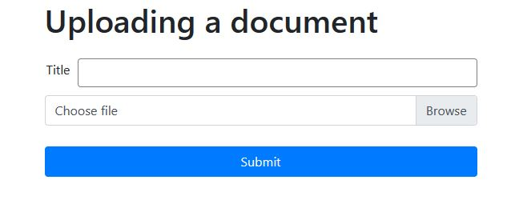

<h1> Document upload documentation</h1>



```
This document API is prepared using Typescript, expressjs/Nodejs and Mongo database and ejs as a template.

All the routes files are in /src/routes
```
<p>The entry point to the system is app.ts. All the necessary files are initialized there </p>

<p style="color:yellow; font-style:italic">To run the application use <strong>npm run start</strong></p>